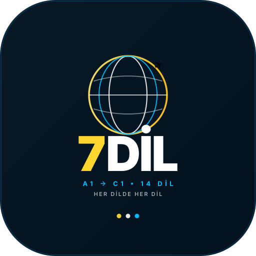

# 7DİL — Her Dilde Her Dil | A1–C1

> 18 ortamda 14 dilde A1'den C1'e AI kişilikli sohbet. Ana dil → hedef dil evrensel. Telefona uygulama olarak yüklenir, offline çalışır.



**Canlı:** `http://localhost:3000` — PWA installable

### Özellikler
- **18 ortam:** Havaalanı, Otel, Restoran, Alışveriş, Şehir, Sosyal, Ev (Anne), İş Yeri (Patron+Lena), Randevu (Sevgili+Garson), Hastane, Banka, Üniversite, Spor, Park, Sinema, Market, Kütüphane + 1 büyük macera
- **14 dil:** 🇬🇧 İngilizce, 🇩🇪 Almanca, 🇫🇷 Fransızca, 🇪🇸 İspanyolca, 🇮🇹 İtalyanca, 🇷🇺 Rusça, 🇨🇳 Çince, 🇯🇵 Japonca, 🇵🇹 Portekizce, 🇸🇦 Arapça, 🇰🇷 Korece, 🇳🇱 Felemenkçe, 🇹🇷 Türkçe, 🇵🇱 Lehçe — **her dilde her dil**: ana dili İngilizce seçip hedef Rusça öğrenebilirsin
- **A1–C1 kapsamlı:** A1 2-4 kelime → C1 25 kelime idiom, AI seviyene göre üretir
- **AI kişilik:** Polis ise polis, Anne ise anne, Sevgili ise sevgili — her sahne ayrı sohbet, hızlı pratik (çipe dokun → cümleye ekle), Telaffuz: “Tamam / Hayır öyle değil, şöyle: …”
- **Görsel:** Her dil ülke foto, her konu ortam foto, `dayBg` 18 foto — saçma animasyon yok
- **PWA:** `manifest.json` + `sw.js` + `icons` — telefona “Ana Ekrana Ekle” → uygulama gibi açılır, offline cache

### Telefona Uygulama Olarak Yükleme (Altyapı Kurulu)

**Android (Chrome):**
1. Siteyi aç → adres çubuğunda “Yükle” veya menü → “Uygulamayı yükle” → Onayla
2. Veya ana ekranda otomatik çıkan **“Telefona Yükle 📲”** kartından **Yükle** butonu

**iPhone (Safari):**
1. Siteyi aç → Paylaş (kare+ok) → **Ana Ekrana Ekle** → Ekle
2. Ana ekrandan 7DİL ikonuyla aç → standalone uygulama

**Test:** Chrome DevTools → Application → Manifest → Installability, Service Workers → `sw.js` active

### Kurulum

```bash
npm install
cp .env.example .env # GROQ_API_KEY ekle
npm run dev    # http://localhost:3000
npm run build  # üretim
npm start
```

GROQ_API_KEY: `your_groq_api_key_here` (.env'e koy, https://console.groq.com/keys)

DATABASE_URL yoksa **demo mod** (localStorage) — varsa Drizzle PostgreSQL.

### Logo
- Profesyonel: `public/logo.svg` (512, gradient #03111d, gold #ffd52f, cyan #00bfff, globe+✈️)
- Icons: `public/icons/icon-192.png`, `icon-512.png`, `apple-touch-icon.png`, `favicon-*.png` (sharp ile üretildi)
- Manifest: `public/manifest.json` — `name: 7DİL`, `short_name: 7DİL`, `display: standalone`, `theme_color: #03111d`

### GitHub Upload

https://github.com/explorerstreasure1-alt/ydpro

```bash
git init
git add .
git commit -m "7DIL v1 — 18 ortam, 14 dil, A1-C1, PWA, logo"
git branch -M main
git remote add origin https://github.com/explorerstreasure1-alt/ydpro.git
git push -u origin main
# veya web: https://github.com/explorerstreasure1-alt/ydpro/upload → sürükle-bırak
```

### Yapı
```
src/app/layout.tsx → manifest + sw register
public/manifest.json, sw.js, logo.svg, icons/
src/lib/ai.ts → GROQ gpt-oss-20b, cache, persona
src/lib/levels.ts → 14 LANGS, CEFR A1-C1, 18 TOPICS
src/lib/content.ts → 18 DAYS (A1-C1)
src/views/mission.tsx → persona + hızlı pratik chips tappable
```

Lisans: MIT
